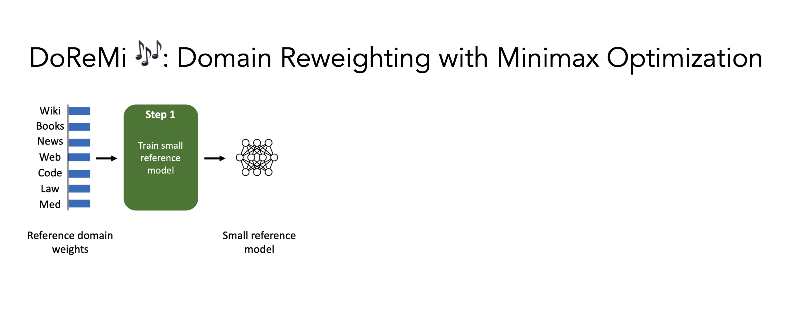
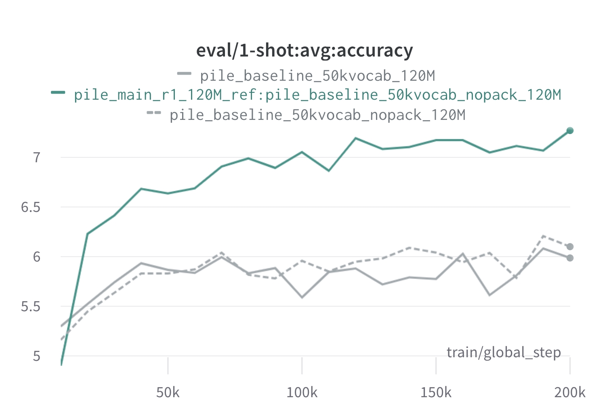

# DoReMi🎶: Domain Reweighting with Minimax Optimization
[](https://opensource.org/licenses/MIT)
[](https://arxiv.org/abs/2305.10429)

PyTorch implementation of DoReMi, an algorithm for optimizing data mixtures for language modeling datasets. Modern large language models are trained on many domains (web, books, arXiv, etc.), but how much of each domain to train on is unclear, especially since these models are going to be used for a variety of downstream tasks (no particular target distribution to optimize for). DoReMi tunes the data mixture to be robust to the target distribution using Distributionally Robust Optimization (DRO). DoReMi trains a small proxy model using DRO, which dynamically upweights or downweights domains based on the proxy model's excess loss compared to a pretrained reference model. The reference model provides an estimate of the best loss achievable to avoid being to pessimistic for high entropy / hard domains. The tuned data mixture can then be used to train a much larger model more efficiently. In the paper, a 280M proxy model can improve the training of a 8B parameter model (30x larger), allowing it to achieve the baseline 8B performance 2.6x faster. The graphic below provides an overview of DoReMi. Check out the [paper](https://arxiv.org/abs/2305.10429) for more details.

As a black box, this codebase outputs optimized domain weights given a text dataset. Some other useful components: fast, resumable dataloader with domain-level weighted sampling, simple downstream eval harness, and HuggingFace Trainer + FlashAttention2 integration.



## Getting started
To get started, please clone the repo and install it:
```
git clone git@github.com:/sangmichaelxie/doremi.git
pip install -e doremi
cd doremi && bash scripts/setup_flash.sh
```

The compilation in `scripts/setup_flash.sh` may take a significant amount of time (hours). All code should be run from the outermost `doremi` directory.
Before you start, write paths to your cache directories, data directories, etc in a `constants.sh` file in the outer directory of this repo. You can also place any conda or virtualenv activation commands here. Here's an example of the contents of a `constants.sh` file (provided as a file called `sample_constants.sh`):
```
#!/bin/bash
CACHE=/path/to/cache
DOREMI_DIR=/path/to/this/repo
PILE_DIR=/path/to/pile
PREPROCESSED_PILE_DIR=/path/to/preprocessed  # will be created by scripts/run_preprocess_pile.sh
MODEL_OUTPUT_DIR=/path/to/model_output_dir
WANDB_API_KEY=key  # Weights and Biases key for logging
PARTITION=partition # for slurm
mkdir -p ${CACHE}
mkdir -p ${MODEL_OUTPUT_DIR}
source ${DOREMI_DIR}/venv/bin/activate  # if you installed doremi in venv
```

Here is how to run the sample script for data preprocessing on The Pile, which separates the Pile data into domains and tokenizes it:
```
bash scripts/run_preprocess_pile.sh
```
Here is a sample script to run 120M baseline, proxy, and main models (all 3 steps in the DoReMi pipeline), tested on one node with 8 A100 GPUs. This is a small version of the Pile experiments in the paper. The script will automatically run perplexity and few-shot evaluation:
```
bash scripts/run_pile.sh
```
These scripts run for 200k steps, following the paper. The DoReMi run outputs domain weights in the `configs` directory with filename `<RUN_NAME>.json`. 

## Running DoReMi on your own dataset
To run DoReMi on your own dataset, provide preprocessed (tokenized) data in the following format:
```
top_level/
    domain_name_1/
        files...
    domain_name_2/
        files...
    ...
```
where each inner directory (e.g., `domain_name_1`) can be loaded via HuggingFace's `load_from_disk` method. If your data is in a different format, you can add a custom data loading function in `doremi/dataloader.py`.
You will also need to write a config file and save it to `configs/` and write run scripts similar to `scripts/runs/run_pile_baseline120M.sh` and `scripts/runs/run_pile_doremi120M.sh` which refer to the config file. The config file specifies the mapping from domain name to mixture weight. The names do not have to be in order (DoReMi will always sort the domain names first to determine a fixed ordering) and the weights do not have to be normalized.

## Tips and details
- **Choice of reference domain weights**: In general, the reference domain weights are a way to express a prior over the importance of the domains. A reasonable default is to set the reference model's domain weights according to the size of each domain, which ensures that the small domains will not be overrepresented (and be overfit). If certain domains are particularly important, you can certainly increase its corresponding reference domain weight. Uniform domain weights could be used as the reference domain weights to avoid putting any prior on the domain weights, but iterated DoReMi will likely be needed (see below).
- **Iterated DoReMi**: In some cases, you may need to run more than 1 round of DoReMi. To run iterated DoReMi, we train a new reference model using the optimized domain weights from the previous round. This helps especially if you start with suboptimal reference domain weights (such as uniform weights), where the reference model trained using those weights will also be suboptimal.
- **Update rate for domain weights (`--reweight_eps`)**: The default setting used in the paper is 1, although this could be tuned for different datasets. Generally, we expect the domain weights during training to be somewhat noisy and the averaged domain weights to be mostly smooth.
- **Choice of tokenizer**: We find that newer tokenizers (like NeoX) tend to give better model performance at smaller scales, so we suggest these over older tokenizers such as GPT2.
- **Running on a subset of domains**: the default dataset loading code will only load the domains listed in the config file. Running on a subset of domains can be achieved by deleting the domain from the config file.
- **Gradient accumulation**: Gradient accumulation should work, and in preliminary tests, the behavior is similar to the no-accumulation scenario. However, currently using accumulation in this implementation is not equivalent to no accumulation. If we accumulate the gradients for `k` steps, there will be `k-1` gradients computed against stale domain weights from the previous iteration (this problem doesn't exist for `k=1`).
- **Multi-node training**: We currently don't support multi-node training, and focus on the single node, multi-GPU setting.

Note that there are a few differences between this repo and the paper, which was developed at Google, namely:
- PyTorch vs JAX
- Subtle differences in model architecture
- Tokenizers used (256k vocab size used in paper, while standard open source tokenizers are around 50k vocab size). This can significantly affect the data mixtures as calculated by token count.
You should run DoReMi within your own specific training setup for the best results.

## Sample run results
Below are results from one round of DoReMi on The Pile using 120M proxy and reference models (with `scripts/run_pile.sh`). We train a 120M model using the optimized weights (`configs/pile_doremi_r1_120M_ref:pile_baseline_50kvocab_nopack_120M.json`) and compare it to the baselines (gray). The two baselines represent two slightly different ways of calculating the baseline domain weights in the Pile (nopack counts the number of examples in each domain after padding each document to the context window length, whereas pack concatenates the documents within one domain first), which produce similar-performing models. The model trained with DoReMi domain weights surpasses the baseline one-shot performance very early during training, within 70k steps (3x faster) across all tasks. The DoReMi model surpasses the average baseline one-shot performance within 20k steps, has improved or comparable perplexity on 15/22 domains, and improves both uniformly averaged and worst-case perplexity across domains.



## Citation

If this was useful to you, please cite the [paper](https://arxiv.org/abs/2305.10429):
```
@article{xie2023doremi,
  author = {Sang Michael Xie and Hieu Pham and Xuanyi Dong and Nan Du and Hanxiao Liu and Yifeng Lu and Percy Liang and Quoc V. Le and Tengyu Ma and Adams Wei Yu},
  journal = {arXiv preprint arXiv:2305.10429},
  title = {DoReMi: Optimizing Data Mixtures Speeds Up Language Model Pretraining},
  year = {2023},
}
```
